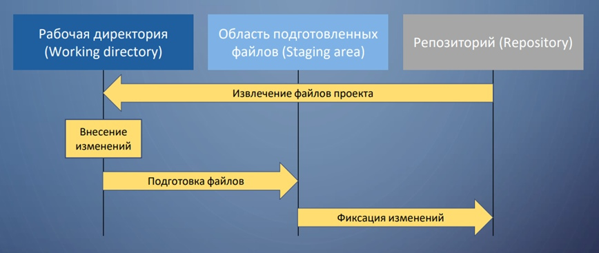

[EXIT](./readme.md)
# 2.2 Основы Git - Запись изменений в репозиторий

## Запись изменений в репозиторий
Итак, у вас имеется настоящий Git-репозиторий и рабочая копия файлов для некоторого проекта. Вам нужно делать некоторые изменения и фиксировать «снимки» состояния (snapshots) этих изменений в вашем репозитории каждый раз, когда проект достигает состояния, которое вам хотелось бы сохранить.

Запомните, каждый файл в вашем рабочем каталоге может находиться в одном из двух состояний: под версионным контролем (отслеживаемые) и нет (неотслеживаемые). Отслеживаемые файлы — это те файлы, которые были в последнем снимке состояния проекта; они могут быть неизменёнными, изменёнными или подготовленными к коммиту. Если кратко, то отслеживаемые файлы — это те файлы, о которых знает Git.

Неотслеживаемые файлы — это всё остальное, любые файлы в вашем рабочем каталоге, которые не входили в ваш последний снимок состояния и не подготовлены к коммиту. Когда вы впервые клонируете репозиторий, все файлы будут отслеживаемыми и неизменёнными, потому что Git только что их извлек и вы ничего пока не редактировали.

Как только вы отредактируете файлы, Git будет рассматривать их как изменённые, так как вы изменили их с момента последнего коммита. Вы индексируете эти изменения, затем фиксируете все проиндексированные изменения, а затем цикл повторяется.

<>
_Рисунок 8. Жизненный цикл состояний файлов_

***Определение состояния файлов***
Основной инструмент, используемый для определения, какие файлы в каком состоянии находятся — это команда `git status`. Если вы выполните эту команду сразу после клонирования, вы увидите что-то вроде этого:
```
$ git status
On branch master
Your branch is up-to-date with 'origin/master'.
nothing to commit, working tree clean
```

Это означает, что у вас чистый рабочий каталог, другими словами — в нем нет отслеживаемых измененных файлов. Git также не обнаружил неотслеживаемых файлов, в противном случае они бы были перечислены здесь. Наконец, команда сообщает вам на какой ветке вы находитесь и сообщает вам, что она не расходится с веткой на сервере. Пока что это всегда ветка master, ветка по умолчанию; в этой главе это не важно. В главе Ветвление в Git будут рассмотрены ветки и ссылки более детально.

Предположим, вы добавили в свой проект новый файл, простой файл `README`. Если этого файла раньше не было, и вы выполните `git status`, вы увидите свой неотслеживаемый файл вот так:
```
$ echo 'My Project' > README
$ git status
On branch master
Your branch is up-to-date with 'origin/master'.
Untracked files:
  (use "git add <file>..." to include in what will be committed)

    README

nothing added to commit but untracked files present (use "git add" to track)
```
Понять, что новый файл `README` неотслеживаемый можно по тому, что он находится в секции «Untracked files» в выводе команды `status`. Статус `Untracked` означает, что Git видит файл, которого не было в предыдущем снимке состояния (коммите); Git не станет добавлять его в ваши коммиты, пока вы его явно об этом не попросите. Это предохранит вас от случайного добавления в репозиторий сгенерированных бинарных файлов или каких-либо других, которые вы и не думали добавлять. Мы хотели добавить README, так давайте сделаем это.

***Отслеживание новых файлов***
Для того чтобы начать отслеживать (добавить под версионный контроль) новый файл, используется команда `git add`. Чтобы начать отслеживание файла `README`, вы можете выполнить следующее:
`$ git add README
`
Если вы снова выполните команду `status`, то увидите, что файл `README` теперь отслеживаемый и добавлен в индекс:
```
$ git status
On branch master
Your branch is up-to-date with 'origin/master'.
Changes to be committed:
  (use "git restore --staged <file>..." to unstage)

    new file:   README
```
Вы можете видеть, что файл проиндексирован, так как он находится в секции «Changes to be committed». Если вы выполните коммит в этот момент, то версия файла, существовавшая на момент выполнения вами команды `git add`, будет добавлена в историю снимков состояния. Как вы помните, когда вы ранее выполнили `git init`, затем вы выполнили `git add (файлы)` — это было сделано для того, чтобы добавить файлы в вашем каталоге под версионный контроль. Команда `git add` принимает параметром путь к файлу или каталогу, если это каталог, команда рекурсивно добавляет все файлы из указанного каталога в индекс.

***Индексация изменённых файлов***
Давайте модифицируем файл, уже находящийся под версионным контролем. Если вы измените отслеживаемый файл `CONTRIBUTING.md` и после этого снова выполните команду `git status`, то результат будет примерно следующим:
```
$ git status
On branch master
Your branch is up-to-date with 'origin/master'.
Changes to be committed:
  (use "git reset HEAD <file>..." to unstage)

    new file:   README

Changes not staged for commit:
  (use "git add <file>..." to update what will be committed)
  (use "git checkout -- <file>..." to discard changes in working directory)

    modified:   CONTRIBUTING.md
```
Файл `CONTRIBUTING.md` находится в секции «Changes not staged for commit» — это означает, что отслеживаемый файл был изменён в рабочем каталоге, но пока не проиндексирован. Чтобы проиндексировать его, необходимо выполнить команду `git add`. Это многофункциональная команда, она используется для добавления под версионный контроль новых файлов, для индексации изменений, а также для других целей, например для указания файлов с исправленным конфликтом слияния. Вам может быть понятнее, если вы будете думать об этом как «добавить этот контент в следующий коммит», а не как «добавить этот файл в проект». Выполним `git add`, чтобы проиндексировать `CONTRIBUTING.md`, а затем снова выполним `git status`:
```
$ git add CONTRIBUTING.md
$ git status
On branch master
Your branch is up-to-date with 'origin/master'.
Changes to be committed:
  (use "git reset HEAD <file>..." to unstage)

    new file:   README
    modified:   CONTRIBUTING.md
```
Теперь оба файла проиндексированы и войдут в следующий коммит. В этот момент вы, предположим, вспомнили одно небольшое изменение, которое вы хотите сделать в `CONTRIBUTING.md` до коммита. Вы открываете файл, вносите и сохраняете необходимые изменения и вроде бы готовы к коммиту. Но давайте-ка ещё раз выполним `git status`:
```
$ vim CONTRIBUTING.md
$ git status
On branch master
Your branch is up-to-date with 'origin/master'.
Changes to be committed:
  (use "git reset HEAD <file>..." to unstage)

    new file:   README
    modified:   CONTRIBUTING.md

Changes not staged for commit:
  (use "git add <file>..." to update what will be committed)
  (use "git checkout -- <file>..." to discard changes in working directory)

    modified:   CONTRIBUTING.md
```
Что за чёрт? Теперь `CONTRIBUTING.md` отображается как проиндексированный и непроиндексированный одновременно. Как такое возможно? Такая ситуация наглядно демонстрирует, что Git индексирует файл в точности в том состоянии, в котором он находился, когда вы выполнили команду `git add`. Если вы выполните коммит сейчас, то файл `CONTRIBUTING.md` попадёт в коммит в том состоянии, в котором он находился, когда вы последний раз выполняли команду `git add` , а не в том, в котором он находится в вашем рабочем каталоге в момент выполнения `git commit`. Если вы изменили файл после выполнения `git add`, вам придётся снова выполнить `git add`, чтобы проиндексировать последнюю версию файла:
```
$ git add CONTRIBUTING.md
$ git status
On branch master
Your branch is up-to-date with 'origin/master'.
Changes to be committed:
  (use "git reset HEAD <file>..." to unstage)

    new file:   README
    modified:   CONTRIBUTING.md
```

***Игнорирование файлов***
Зачастую, у вас имеется группа файлов, которые вы не только не хотите автоматически добавлять в репозиторий, но и видеть в списках неотслеживаемых. К таким файлам обычно относятся автоматически генерируемые файлы (различные логи, результаты сборки программ и т. п.). В таком случае, вы можете создать файл `.gitignore`. с перечислением шаблонов соответствующих таким файлам. Вот пример файла `.gitignore`:
```
$ cat .gitignore
*.[oa]
*~
```
Первая строка предписывает Git игнорировать любые файлы заканчивающиеся на «.o» или «.a» — объектные и архивные файлы, которые могут появиться во время сборки кода. Вторая строка предписывает игнорировать все файлы заканчивающиеся на тильду`(~)`, которая используется во многих текстовых редакторах, например Emacs, для обозначения временных файлов. Вы можете также включить каталоги log, tmp или pid; автоматически создаваемую документацию; и т. д. и т. п. Хорошая практика заключается в настройке файла `.gitignore` до того, как начать серьёзно работать, это защитит вас от случайного добавления в репозиторий файлов, которых вы там видеть не хотите.

К шаблонам в файле .gitignore применяются следующие правила:

1. Пустые строки, а также строки, начинающиеся с #, игнорируются.

2. Стандартные шаблоны являются глобальными и применяются рекурсивно для всего дерева каталогов.

3. Чтобы избежать рекурсии используйте символ слеш (/) в начале шаблона.

4. Чтобы исключить каталог добавьте слеш (/) в конец шаблона.

5. Можно инвертировать шаблон, использовав восклицательный знак (!) в качестве первого символа.

Glob-шаблоны представляют собой упрощённые регулярные выражения, используемые командными интерпретаторами. Символ (`*`) соответствует 0 или более символам; последовательность `[abc]` — любому символу из указанных в скобках (в данном примере a, b или c); знак вопроса (`?`) соответствует одному символу; и квадратные скобки, в которые заключены символы, разделённые дефисом (`[0-9]`), соответствуют любому символу из интервала (в данном случае от 0 до 9). Вы также можете использовать две звёздочки, чтобы указать на вложенные каталоги: `a/**/z` соответствует `a/z`, `a/b/z`, `a/b/c/z`, и так далее.

Вот ещё один пример файла `.gitignore`:
```
# Исключить все файлы с расширением .a
*.a

# Но отслеживать файл lib.a даже если он подпадает под исключение выше
!lib.a

# Исключить файл TODO в корневом каталоге, но не файл в subdir/TODO
/TODO

# Игнорировать все файлы в каталоге build/
build/

# Игнорировать файл doc/notes.txt, но не файл doc/server/arch.txt
doc/*.txt

# Игнорировать все .txt файлы в каталоге doc/
doc/**/*.txt
```

***Коммит изменений***
Теперь, когда ваш индекс находится в таком состоянии, как вам и хотелось, вы можете зафиксировать свои изменения. Запомните, всё, что до сих пор не проиндексировано — любые файлы, созданные или изменённые вами, и для которых вы не выполнили `git add` после редактирования — не войдут в этот коммит. Они останутся изменёнными файлами на вашем диске. В нашем случае, когда вы в последний раз выполняли `git status`, вы видели что всё проиндексировано, и вот, вы готовы к коммиту. Простейший способ зафиксировать изменения — это набрать `git commit`:
```
$ git commit
```
Эта команда откроет выбранный вами текстовый редактор.
В редакторе будет отображён следующий текст (это пример окна Vim):
```
# Please enter the commit message for your changes. Lines starting
# with '#' will be ignored, and an empty message aborts the commit.
# On branch master
# Your branch is up-to-date with 'origin/master'.
#
# Changes to be committed:
#	new file:   README
#	modified:   CONTRIBUTING.md
#
~
~
~
".git/COMMIT_EDITMSG" 9L, 283C
```
Вы можете видеть, что комментарий по умолчанию для коммита содержит закомментированный результат работы команды `git status` и ещё одну пустую строку сверху. Вы можете удалить эти комментарии и набрать своё сообщение или же оставить их для напоминания о том, что вы фиксируете.

Когда вы выходите из редактора, Git создаёт для вас коммит с этим сообщением, удаляя комментарии и вывод команды `diff`.
Есть и другой способ — вы можете набрать свой комментарий к коммиту в командной строке вместе с командой `commit` указав его после параметра `-m`, как в следующем примере:
```
$ git commit -m "Story 182: fix benchmarks for speed"
[master 463dc4f] Story 182: fix benchmarks for speed
 2 files changed, 2 insertions(+)
 create mode 100644 README
```
Итак, вы создали свой первый коммит! Вы можете видеть, что коммит вывел вам немного информации о себе: на какую ветку вы выполнили коммит (`master`), какая контрольная сумма SHA-1 у этого коммита (`463dc4f`), сколько файлов было изменено, а также статистику по добавленным/удалённым строкам в этом коммите.

Запомните, что коммит сохраняет снимок состояния вашего индекса. Всё, что вы не проиндексировали, так и висит в рабочем каталоге как изменённое; вы можете сделать ещё один коммит, чтобы добавить эти изменения в репозиторий. Каждый раз, когда вы делаете коммит, вы сохраняете снимок состояния вашего проекта, который позже вы можете восстановить или с которым можно сравнить текущее состояние.

