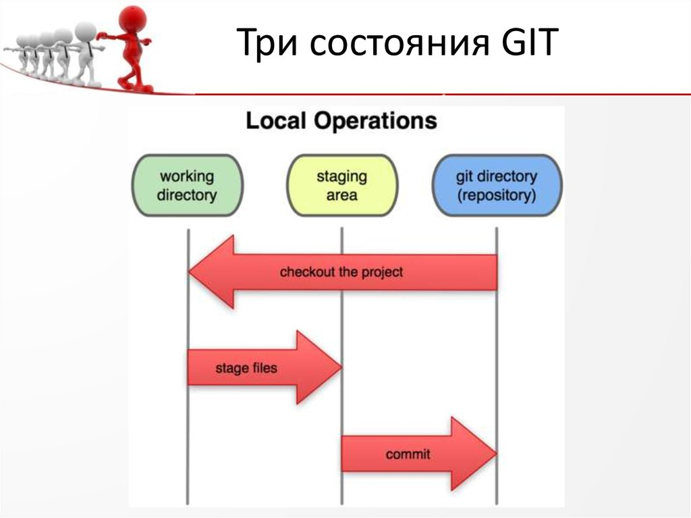

[EXIT](./readme.md)
# 1.2 Введение - Что такое Git?

Что же такое Git, если говорить коротко? Очень важно понять эту часть материала, потому что если вы поймёте, что такое Git и основы того, как он работает, тогда, возможно, вам будет гораздо проще его использовать. Пока вы изучаете Git, попробуйте забыть всё, что вы знаете о других СКВ, таких как Subversion и Perforce. Это позволит вам избежать определённых проблем при использовании инструмента. Git хранит и использует информацию совсем иначе по сравнению с другими системами, даже несмотря на то, что интерфейс пользователя достаточно похож, и понимание этих различий поможет вам избежать путаницы во время использования.

***Снимки, а не различия***
Основное отличие Git от любой другой СКВ (включая Subversion и её собратьев) — это подход к работе со своими данными. Концептуально, большинство других систем хранят информацию в виде списка изменений в файлах. Эти системы (CVS, Subversion, Perforce, Bazaar и т. д.) представляют хранимую информацию в виде набора файлов и изменений, сделанных в каждом файле, по времени (обычно это называют контролем версий, основанным на различиях).

<>
_Рисунок 4. Хранение данных как набора изменений относительно первоначальной версии каждого из файлов_

Git не хранит и не обрабатывает данные таким способом. Вместо этого, подход Git к хранению данных больше похож на набор снимков миниатюрной файловой системы. Каждый раз, когда вы делаете коммит, то есть сохраняете состояние своего проекта в Git, система запоминает, как выглядит каждый файл в этот момент, и сохраняет ссылку на этот снимок. Для увеличения эффективности, если файлы не были изменены, Git не запоминает эти файлы вновь, а только создаёт ссылку на предыдущую версию идентичного файла, который уже сохранён. Git представляет свои данные как, скажем, поток снимков.

<>
_Рисунок 5. Хранение данных как снимков проекта во времени_

Это очень важное отличие между Git и почти любой другой СКВ. Git переосмысливает практически все аспекты контроля версий, которые были скопированы из предыдущего поколения большинством других систем. Это делает Git больше похожим на миниатюрную файловую систему с удивительно мощными утилитами, надстроенными над ней, нежели просто на СКВ. Когда мы будем рассматривать управление ветками в главе Ветвление в Git, мы увидим, какие преимущества вносит такой подход к работе с данными в Git.

***Почти все операции выполняются локально***
Для работы большинства операций в Git достаточно локальных файлов и ресурсов — в основном, системе не нужна никакая информация с других компьютеров в вашей сети. Если вы привыкли к ЦСКВ, где большинство операций страдают от задержек из-за работы с сетью, то этот аспект Git заставит вас думать, что боги скорости наделили Git несказанной мощью. Так как вся история проекта хранится прямо на вашем локальном диске, большинство операций кажутся чуть ли не мгновенными.

Для примера, чтобы посмотреть историю проекта, Git не нужно соединяться с сервером для её получения и отображения — система просто считывает данные напрямую из локальной базы данных. Это означает, что вы увидите историю проекта практически моментально. Если вам необходимо посмотреть изменения, сделанные между текущей версией файла и версией, созданной месяц назад, Git может найти файл месячной давности и локально вычислить изменения, вместо того, чтобы запрашивать удалённый сервер выполнить эту операцию, либо вместо получения старой версии файла с сервера и выполнения операции локально.

Это также означает, что есть лишь небольшое количество действий, которые вы не сможете выполнить, если вы находитесь оффлайн или не имеете доступа к VPN в данный момент. Если вы в самолёте или в поезде и хотите немного поработать, вы сможете создавать коммиты без каких-либо проблем (в вашу локальную копию, помните?): когда будет возможность подключиться к сети, все изменения можно будет синхронизировать. Если вы ушли домой и не можете подключиться через VPN, вы всё равно сможете работать. Добиться такого же поведения во многих других системах либо очень сложно, либо вовсе невозможно. В Perforce, для примера, если вы не подключены к серверу, вам не удастся сделать многого; в Subversion и CVS вы можете редактировать файлы, но вы не сможете сохранить изменения в базу данных (потому что вы не подключены к БД). Всё это может показаться не таким уж и значимым, но вы удивитесь, какое большое значение это может иметь.

***Git обычно только добавляет данные***
Когда вы производите какие-либо действия в Git, практически все из них только добавляют новые данные в базу Git. Очень сложно заставить систему удалить данные либо сделать что-то, что нельзя впоследствии отменить. Как и в любой другой СКВ, вы можете потерять или испортить свои изменения, пока они не зафиксированы, но после того, как вы зафиксируете снимок в Git, будет очень сложно что-либо потерять, особенно, если вы регулярно синхронизируете свою базу с другим репозиторием.

Всё это превращает использование Git в одно удовольствие, потому что мы знаем, что можем экспериментировать, не боясь серьёзных проблем. 

***Три состояния***
Теперь слушайте внимательно. Это самая важная вещь, которую нужно запомнить о Git, если вы хотите, чтобы остаток процесса обучения прошёл гладко. 
У Git есть три основных состояния, в которых могут находиться ваши файлы: _изменён_ (modified), _индексирован_ (staged) и _зафиксирован_ (committed):
+ К изменённым относятся файлы, которые поменялись, но ещё не были зафиксированы.
+ Индексированный — это изменённый файл в его текущей версии, отмеченный для включения в следующий коммит.
+ Зафиксированный значит, что файл уже сохранён в вашей локальной базе.
Мы подошли к трём основным секциям проекта Git: рабочая копия (working directory), область индексирования (staging area) и каталог Git (Git directory).

<>
_Рисунок 6. Рабочая копия, область индексирования и каталог Git_

Рабочая копия является снимком одной версии проекта. Эти файлы извлекаются из сжатой базы данных в каталоге Git и помещаются на диск, для того чтобы их можно было использовать или редактировать.

Область индексирования — это файл, обычно находящийся в каталоге Git, в нём содержится информация о том, что попадёт в следующий коммит. Её техническое название на языке Git — «индекс», но фраза «область индексирования» также работает.

Каталог Git — это то место, где Git хранит метаданные и базу объектов вашего проекта. Это самая важная часть Git и это та часть, которая копируется при клонировании репозитория с другого компьютера.

Базовый подход в работе с Git выглядит так:

1) Изменяете файлы вашей рабочей копии.
2) Выборочно добавляете в индекс только те изменения, которые должны попасть в следующий коммит, добавляя тем самым снимки только этих изменений в индекс.
3) Когда вы делаете коммит, используются файлы из индекса как есть, и этот снимок сохраняется в ваш каталог Git.

Если определённая версия файла есть в каталоге Git, эта версия считается зафиксированной (committed). Если файл был изменён и добавлен в индекс, значит, он индексирован (staged). И если файл был изменён с момента последнего распаковывания из репозитория, но не был добавлен в индекс, он считается изменённым (modified). В главе Основы Git вы узнаете больше об этих состояниях и какую пользу вы можете извлечь из них или как полностью пропустить часть с индексом.